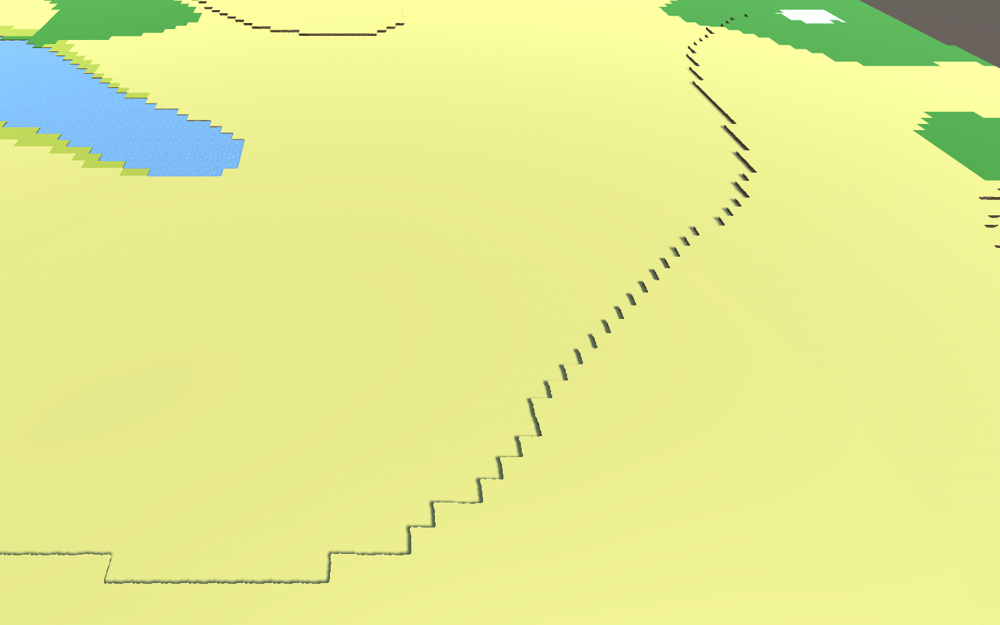
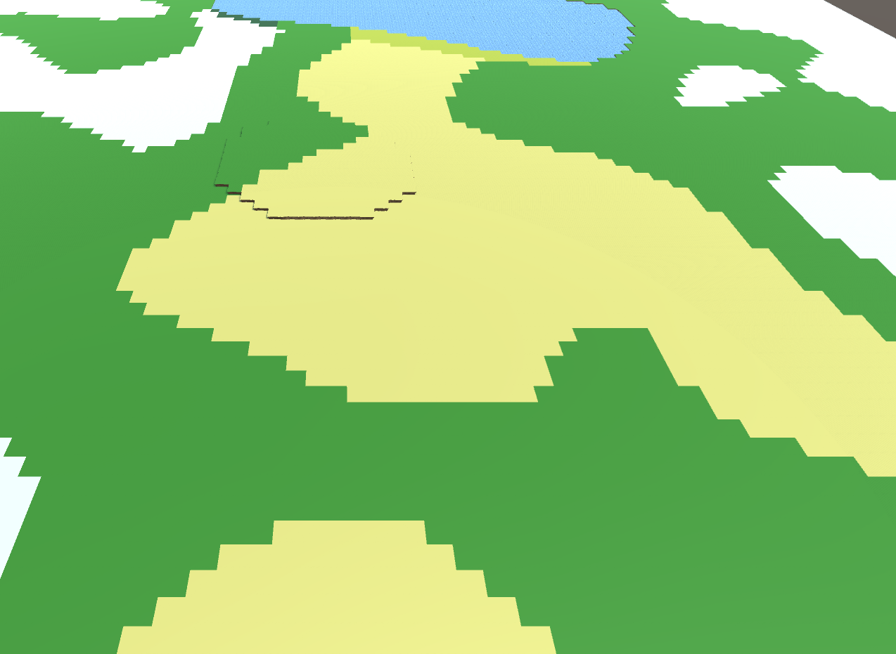
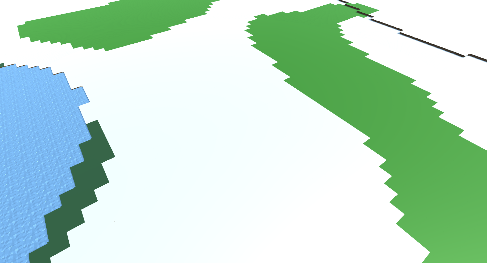

# Unity Map

Générateur procédural de carte sur Unity 

## 🚀 Fonctionnalités

-Créer une carte en fonction d'une seed de génération et différent paramétres
-Régler la température,l'altitude et l'humidité pour modifier la  génération

## 🛠️ Technologies utilisées

-Moteur de jeu: Unity
-Code: C#
-Modél 3D : Blender

## Images

